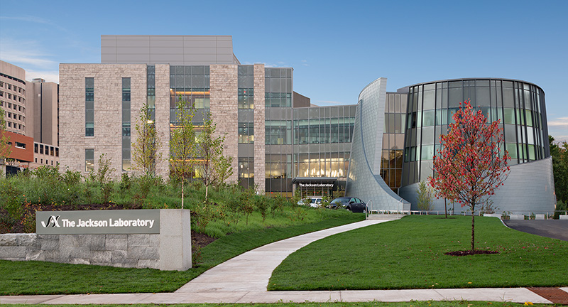

# Contact

Peter Robinson
 
* Professor, Jackson Laboratory for Genomic medicine
* Donald A. Roux Chair, Genomics and Computational Biology (2017-2023)
* Professor for Medical Computational Science, Berlin Institute if Health (2024-)
* Director,  [Human Phenotype Ontology Consortium](https://hpo.jax.org/app/)
* Co-Program Director, [Monarch Initiative](http://monarchinitiative.org)
* [email](mailto:peter.robinson@jax.org)

<figure markdown>
{ width="400" }
<figcaption>Peter Robinson
</figcaption>
</figure>

## Berlin Institute of Health (from 2024)

Starting in January, 2024, the Robinson Lab will be located at the Berlin Institute of Health (BIH) in the 
Rahel Hirsch Center for Translational Medicine of the Charité in Berlin Mitte.

<figure markdown>
{ width="400" }
<figcaption>Berlin Institute of Health
</figcaption>
</figure>

## The Jackson Laboratory for Genomic Medicine

The Robinson Lab will also be located at the Jackson Laboratory (JAX) in the
for Genomic Medicine campus in Farmington Connecticut.

<figure markdown>
{ width="400" }
<figcaption>The Jackson Laboratory for Genomic Medicine
</figcaption>
</figure>

