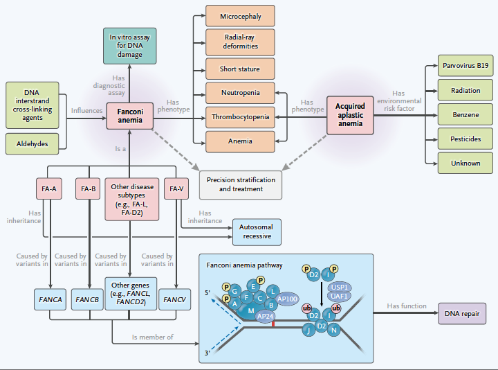

# Introduction

The Robinson Lab has developed a wide range of ontologies and algorithms for exome and genome sequencing, ChIP-seq, immunogenomics, and other genomics applications, Gene Ontology analysis, computational phenotype analysis, as well as various algorithms from the fields of Machine Learning and modeling of biological networks with the tools of linear  algebra and graph theory. software for computational phenotype analysis, translational genomics, ChIP-seq, and whole-exome/whole-genome sequence analysis. 

The Robinson Lab started at the [Charité – Universitätsmedizin Berlin](https://www.charite.de/) and moved to the 
[Jackson Laboratory (JAX) for Genomic Medicine](https://www.jax.org/) in 2016. The Lab is moving to the [Berlin Institute of Health](https://www.bihealth.org/en/) in 2024 and will be retaining an affiliation with JAX. The Lab's activities will be supported by a [Humboldt Professorship](https://www.humboldt-foundation.de/entdecken/newsroom/dossier-alexander-von-humboldt-professur/peter-nicholas-robinson).

## Research

We have developed the
Human Phenotype Ontology and the GA4GH Phenopacket Schema, leading examples of computational knowledge 
representation, a field of artificial intelligence that represents domain knowledge in a form that 
computer algorithms can leverage to perform complex tasks. We develop algorithms 
that leverage ontologies, statistical, semantic, Bayesian, and machine-learning methologies in innovative ways 
to address challenges in rare-disease and precision medicine. The focus of the research is both on the 
development of new AI algorithms and their application to medical data. 

### Ontologies

A major focus of the lab is to create ontologies for representing and analyzing medical data. Ontologies allow clinical data to be modeled computationally in a way that enables differential diagnostic support and machine learning.

<figure markdown>
{ width="500" }
<figcaption>Ontology-Driven Representation of Clinical Data. Taken from Haendel MA, Chute CG, Robinson PN. Classification, Ontology, and Precision Medicine. N Engl J Med. 2018 Oct 11;379(15):1452-1462.
</figcaption>
</figure>

Our group has created the [Human Phenotype Ontology](http:///www.human-phenotype-ontology.org) and the [Medical Action Ontology](https://pubmed.ncbi.nlm.nih.gov/37503136/) and has led the development of the [Phenopacket Schema](https://pubmed.ncbi.nlm.nih.gov/35705716/) for the [Global Alliance for Genomics and Health](https://www.ga4gh.org/). Our work is performed as part of the [Monarch Initiative](http://monarchinitiative.org), and international team of ontologiests and bioinformaticians dedicated to applying ontologies and semantic algorithms to improve human health.

### Translational and Genomic Bioinformatics

Our group creates algorithms for translational and genomic research. Topics include diagnostic exome and genome sequencing, analysis of genomic data from RNA-seq, ChIP-seq, and Hi-C, and Machine Learning

<figure markdown>
{ width="400" }
<figcaption>Krawitz, P. M., et al. (2010). Identity-by-descent filtering of exome sequence data identifies PIGV mutations in hyperphosphatasia mental retardation syndrome. Nat. Genet. 42:827–829.
</figcaption>
</figure>