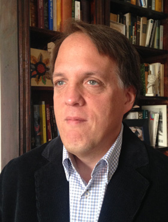
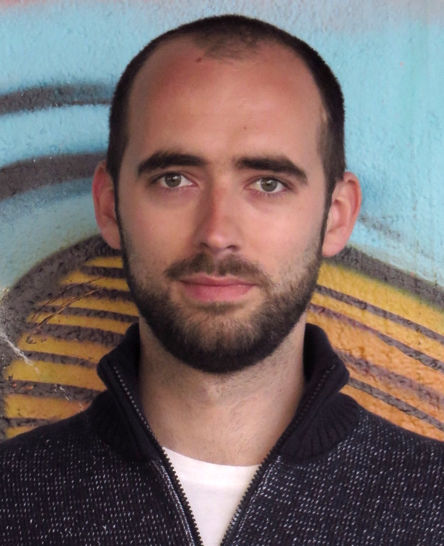

# People

## Peter N. Robinson, MD

We are living in a time of unparalleled opportunity to extend our understanding of human disease and improve the care of patients with precision genomic medicine. Sophisticated bioinformatics and computational biology are essential to achieve the full potential of genomics for science as well as for patients. Peter Robinson, Professor and Donald A. Roux Chair, Genomics and Computational Biology, leads a research group dedicated to the development of algorithms and computational resources for genomics. Peter is a PI of the
[Monarch Initiative](https://monarchinitiative.org), an NIH supported project dedicated to the integration, alignment, and re-distribution of cross-species gene, genotype, variant, disease, and phenotype data. Highlights of the lab’s work include the [Human Phenotype Ontology](http://www.human-phenotype-ontology.org), the [Exomiser](https://monarchinitiative.org/page/exomes) suite  of tools for exome and genome analysis, and algorithms for ChIP-seq and immunogenomics. Peter studied Mathematics (Bachelor) at Columbia College, Medicine at the University of Pennsylvania, and Computer Science (Master's) at Columbia University. He completed an internship in Primary Care Internal Medicine at Yale University, and a residency (Facharzt) in Pediatrics at Charité - Universitätsmedizin Berlin in Berlin, Germany. Subsequent to that, he led the Bioinformatics group at the Institute for Medical Genetics and Human Genetics at the Charité from 2004-2016. In 2016, he relocated to the Jackson Laboratory for Genomic Medicine in Connecticut, USA.

<figure markdown>
{ width="400" }
<figcaption>Peter Robinson
</figcaption>
</figure>

## Lab Members

### Hannah Blau, Ph.D.

<figure markdown>
{ width="400" }
<figcaption>Hannah Blau
</figcaption>
</figure>

Hannah Blau joined the Robinson Lab as Research
Software Engineer in May, 2017. She completed her Ph.D. in Computer
Science at the University of Massachusetts Amherst. She earned the
B.A. in French from Yale University and the M.S.E. in Computer and
Information Science from the University of Pennsylvania. Hannah gained
international experience at the Artificial Intelligence Center of
the Bull Corporation (Louveciennes, France), and in the Machine
Learning Group of the Daimler-Benz Research Centre (Ulm, Germany). She
worked as a Research Scientist in the Automated Reasoning Group of
the Honeywell Technology Center (Minneapolis, Minnesota). While in
grad school she served as data scientist in the lab of Professor
M. Darby Dyar, Chair of Astronomy at Mount Holyoke College and
member of the science team for the Mars Science Laboratory
(Curiosity rover).
            

### Leigh Carmody, Ph.D.

<figure markdown>
{ width="400" }
<figcaption>Leigh Carmody
</figcaption>
</figure>

Leigh Carmody, Ph.D., obtained her doctorate of philosophy in Molecular Physiology &#38; Biophysics from Vanderbilt University in Spring 2007 where she studied targeting of signaling molecules to F-actin cytoskeleton/dendritic spines. Dr. Carmody continued her studies as a postdoctoral fellow at Massachusetts Institute of Technology where she investigated the role of Rac1 in dendritic spine motility. Late 2008, she joined the Broad Institute of MIT &#38; Harvard as a Scientist where she aided in early-stage drug discovery efforts to identify chemical leads directed at cancer targets and neglected parasitic infections.  Dr. Carmody joined Jackson Laboratory in 2015 as a Project Manager, and is currently a Scientific Curator annotating phenotyping and genomics data for the human phenotype ontology (HPO) database.

### Daniel Danis, Ph.D.

<figure markdown>
{ width="400" }
<figcaption>Daniel Danis
</figcaption>
</figure>

Daniel has a M.Sc. in Pharmacy from the Comenius University, Bratislava, Slovakia. He is currently working on his Ph.D., mainly focused on the molecular basis and pathomechanisms of rare hereditary diseases in human patients. He has experience in the assembly of custom UNIX-based bioinformatics pipelines for whole exome sequencing data analysis that have identified disease-causing variants in several Slovak families.
His work in the Robinson lab involves the development of algorithms for prioritizing exome and genome variants. These new algorithms are designed to integrate into the Exomiser and Genomiser frameworks. In addition, he works on tools for the biocuration of published disease-causing variants.

### Guy Karlebach, Ph.D.

<figure markdown>
{ width="400" }
<figcaption>Guy Karlebach
</figcaption>
</figure>

Guy earned his B.Sc. in Computer Science from the Technion, Israel Institute of Technology, his Masters in Computer Science from Ben Gurion University, and his Ph.D. in Computer Science from Tel-Aviv University. During his Masters he worked on computational protein structure prediction, developing methods for refining approximate 3D structures. During his Ph.D. he developed algorithms for modeling gene regulatory networks using DNA binding and gene expression data.  He has acquired research experience in academia at the Max Planck Institute and in industry working for IBM’s medical informatics group.  He is now a Postdoctoral Associate in the Robinson lab developing methods that integrate high-throughput genomic data for a better quantification of variation in gene expression under different conditions.  The ultimate goal is to use different technologies in a complementary way that compensates for each individual technology’s shortcomings.

### Peter Hansen, Ph.D.

### Alumni

            
* Vida Ravanmehr, Ph.D.
* Xingmin “Aaron” Zhang, Ph.D.
* Sebastian Köhler, Dr. rer. nat. (<a href="http://drseb.github.io" target="_blank">Homepage</a>)
* Peter Krawitz, Dr.med., Dipl. Phys. 
* Marten Jäger, Msc Bioinformatik (<a href="https://scholar.google.com/citations?user=gcv8LpcAAAAJ" target="_blank">Google Scholar</a>)
* Max Schubach, MSc. Bioinformatik  (<a href="https://scholar.google.de/citations?user=rIsf3wMAAAAJ" target="_blank">Google Scholar</a>)
* Leon Kuchenbecker, MSc. Bioinformatik
* Robin Steinhaus
* Layal Abo-Kayal
* Na Zhu
* Christian Rödelsperger
* Duc Dang
* Martin-Atta Mensah
* Patrick Booms
* Marcel H Schulz
* Miriam Sandya Bauer
* Sandra Appelt 
* Martin Wettig 
* Begoña Muñoz-Garcia
* Dmitri Parkhomchuk
* Dr. Sebastian Bauer
* Oliver Stolpe
* Manuel Holgrewe
* Verena Heinrich     