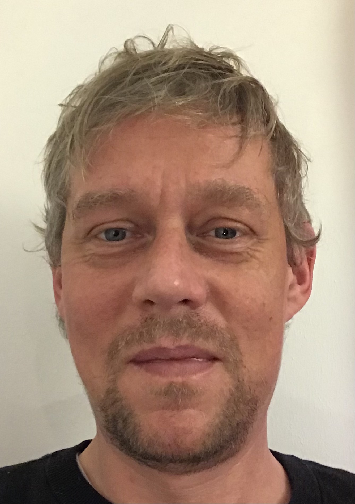
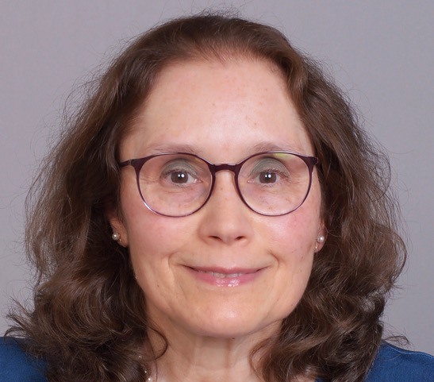

# People

## Peter N. Robinson, MD

We are living in a time of unparalleled opportunity to extend our understanding of human disease and improve the 
care of patients with precision genomic medicine. Sophisticated bioinformatics and computational biology are 
essential to achieve the full potential of genomics for science as well as for patients. Peter Robinson, 
Professor and Donald A. Roux Chair, Genomics and Computational Biology, leads a research group dedicated to the 
development of algorithms and computational resources for genomics. Peter is a PI of the
[Monarch Initiative](https://monarchinitiative.org), an NIH supported project dedicated to the integration, 
alignment, and re-distribution of cross-species gene, genotype, variant, disease, and phenotype data. Highlights 
of the lab’s work include the [Human Phenotype Ontology](http://www.human-phenotype-ontology.org), 
the [Exomiser](https://monarchinitiative.org/page/exomes) suite  of tools for exome and genome analysis, 
and algorithms for ChIP-seq and immunogenomics. Peter studied Mathematics (Bachelor) at Columbia College, 
Medicine at the University of Pennsylvania, and Computer Science (Master's) at Columbia University. 
He completed an internship in Primary Care Internal Medicine at Yale University, and a residency (Facharzt) in 
Pediatrics  and obtained a Habilitation (roughly equivalent
to a PhD) in Human Genetics at the Charité - Universitätsmedizin Berlin. He led the 
Bioinformatics group at the Institute for Medical Genetics and Human Genetics at the Charité from 2004-2016. 
From 2016-2023, he led a research group at  the Jackson Laboratory (JAX) for Genomic Medicine in Connecticut, USA. 
From 2024, his primary affiliation will be with the Berlin Institute of Health (BIH) and he will continue to
be affiliated with JAX.

<figure markdown>
{ width="200" }
<figcaption>Peter Robinson
</figcaption>
</figure>

## Lab Members

### Martha Beckwith, Ph.D.

<figure markdown>
{ width="200" }
<figcaption>Martha Beckwith
</figcaption>
</figure>

Martha Beckwith obtained her PhD in Physical Chemistry from Cornell 
University. During her PhD, she also conducted research at the Max-Planck-
Institute for Chemical Energy Conversion in Germany. Prior to joining the 
Robinson Lab, she was a Postdoctoral Research Associate at Lawrence 
Livermore National Laboratory, and then a Computational Scientist at the 
CUNY Advanced Science Research Center. Her current work focuses on 
developing software for incorporating clinical intuition in phenotype-driven 
prioritization of rare diseases.

### Ben Coleman
<figure markdown>
{ width="200" }
<figcaption>Ben Coleman
</figcaption>
</figure>

I am a current MD-PhD student at UConn School of Medicine with a background in physics. 
I joined the Robinson Lab after two years of medical school to conduct my thesis research. 
My research focuses on using the Human Phenotype Ontology (HPO) to describe and understand 
the phenotypic features of neurodevelopmental disorders in a generalizable and computable format. 
By improving the way we describe patient phenotypes, we will improve our ability to identify 
the genetic drivers of these phenotypes. To do this, I work with domain experts to expand the 
HPO's terminology for neurodevelopmental disorders and to develop tools to translate clinical 
measurements to the HPO.

### Daniel Danis, Ph.D.

<figure markdown>
{ width="200" }
<figcaption>Daniel Danis
</figcaption>
</figure>

Daniel has a M.Sc. in Pharmacy from the Comenius University, Bratislava, Slovakia. He is currently working on his Ph.D., mainly focused on the molecular basis and pathomechanisms of rare hereditary diseases in human patients. He has experience in the assembly of custom UNIX-based bioinformatics pipelines for whole exome sequencing data analysis that have identified disease-causing variants in several Slovak families.
His work in the Robinson lab involves the development of algorithms for prioritizing exome and genome variants. These new algorithms are designed to integrate into the Exomiser and Genomiser frameworks. In addition, he works on tools for the biocuration of published disease-causing variants.

### Michael Gargano 

<figure markdown>
{ width="200" }
<figcaption>Michael Gargano
</figcaption>
</figure>

Michael Gargano has an M.S in Bioinformatics from Northeastern University. First starting as a UI 
Developer at Cigna, he joined both The Jackson Laboratory & the Robinson Lab in 2017, and has grown to 
a Senior Scientific Software Engineer. Bringing the Human Phenotype Ontology to the modern web was his 
flagship project. He now specializes in data engineering on the cloud, restful applications, bioinformatics 
pipelines, and architecting software solutions for translational & clinical genomics.

### Peter Hansen, Ph.D.

<figure markdown>
{ width="200" }
<figcaption>Peter Hansen
</figcaption>
</figure>

Peter Hansen studied bioinformatics at the Free University of Berlin from 2003 to 2010.
In 2011, he began his professional career at the Institute for Medical Genetics and Human Genetics at the Charité hospital in Berlin,
where he set up analysis pipelines for high-throughput sequencing data.
By analyzing ChIP-seq data from different collaborators,
he helped to elucidate the roles of various transcription factors in different contexts,
for example HOXD13 and PITX1 in limb development, PAX5 in classical Hodgkin's lymphoma, or E2F6 in CGI methylation.
In 2014, he continued his education as a doctoral student.
He developed the ChIP-seq peak calling software
[Q and Q-nexus](https://github.com/charite/Q).
Moreover, he led the project "Genomic diagnostics for the regulatory genome" at the Charité on behalf of Peter Robinson,
with a focus on conducting capture Hi-C experiments and data analysis.
In 2019, he received his
[Ph.D. in Bioinformatics](https://refubium.fu-berlin.de/bitstream/handle/fub188/24639/thesis_Hansen.pdf)
from the Department of Mathematics and Computer Science at the Free University Berlin and joined The Jackson Laboratory
for Genomic Medicine as a Bioinformatics Analyst.
He developed [GOPHER](https://github.com/TheJacksonLaboratory/Gopher),
a desktop application for capture Hi-C probe design,
and [Diachromatic](https://github.com/TheJacksonLaboratory/diachromatic),
a toolset for preprocessing and quality control of Hi-C and capture Hi-C data.
Furthermore, he characterized a feature of Hi-C data and used it to assess and mitigate technical bias.
In parallel, he contributed to team projects on a variety of topics
including the analysis of differential expression and splicing,
prediction of isoform functions,
prediction of associations between protein kinases and cancer,
and challenges in biomedical knowledge graph representation.
More recently, he has been working on ontologizing experimental mouse data from the Mouse Phenome Database at JAX and
representing it as Phenopakets.

### Kristin Köhler
<figure markdown>
{ width="200" }
<figcaption>Kristin Köhler
</figcaption>
</figure>

Kristin earned her B.Sc. and M.Sc. in Bioinformatics from Free Universität Berlin. After completing her bachelor’s studies, she joined the Kircher lab at the Berlin Institute of Health (BIH), where she developed methods to analyze cfDNA from liquid biopsies and built predictive models for cancer diagnosis. During her master’s studies, she joined the Conrad lab at BIH, where she developed data processing pipelines for single-cell transcriptomics using nanopore technologies. This work enabled detailed analysis of transcript expression and splicing at the single-cell level. In May 2024, Kristin began her PhD at BIH, working jointly in the groups of Peter N. Robinson and Christian Conrad. Bridging the gap between wet and dry lab research, she focuses on developing software to analyze large-scale transcriptomic data, leveraging cutting-edge single-cell and spatial technologies.

### Leonardo Chimirri, Ph.D.
<figure markdown>
{ width="200" }
<figcaption>Leonardo Chimirri
</figcaption>
</figure>

Leonardo received his B.Sc. in Physics and M.Sc. in Theoretical Physics (2013-2018) at University of Torino, Italy, before moving to Berlin where he earned his Ph.D. in Theoretical Particle Physics (2019-2023) at Humboldt University Berlin and DESY-Zeuthen. During his Master and then Ph.D. theses he focused on lattice field theories, a computationally intensive approach based on stochastic simulations. There he expanded his interest and experience in programming, mathematical modelling, data analysis and machine learning. Driven by his deep desire to apply his skills to improve people's lives and health and given his broad scientific interest, among which computational biology and genetics stand out, he decided to change career focus and joined the Robinson Lab in April 2024. This was facilitated by coming into contact with knowledge graphs, ontologies, and rare genetic diseases when working as a volunteer at MI4People gGmbH (German non-profit), which he still supports whenever possible. He has been focusing on LLMs for differentials diagnostics of rare diseases throughout his first period in the Lab. Other topics he is starting to explore are bayesian networks for differential diagnostics and training of machine learning models for prioritizing pathogenic variants of non-coding DNA regions. 
[Google Scholar](https://scholar.google.com/citations?user=9ltLmKMAAAAJ&hl=en), [ORCID](https://orcid.org/0000-0002-6912-8518)

### Enock Niyonkuru

<figure markdown>
{ width="200" }
<figcaption>Enock Niyonkuru
</figcaption>
</figure>

Enock is pursuing his BS in Computer Science at Trinity College, CT. 
He became a member of The Robinson Lab in Fall 2021. From a young age, Enock was deeply intrigued by the 
potential of Artificial Intelligence in enhancing healthcare. This interest was further cemented 
during his high school years when he shadowed physicians at a Rwandan hospital and recognized the 
pressing need for advanced technology in the medical field. Within the Lab, Enock focuses on developing 
software and algorithms to refine text mining techniques. He integrates Machine Learning and 
Large Language Models to assist in the curation of the Medical Action Ontology (MAxO) and contributes to 
various other bioinformatics initiatives. 

### Lauren Rekerle

<figure markdown>
{ width="200" }
<figcaption>Lauren Rekerle
</figcaption>
</figure>
Lauren Rekerle received her B.Sc. in Bioinformatics from Michigan Technological University (2017) and her M.Sc. in Computational Biology from the University of Minnesota (2019). During her time as a master’s student, she worked with the National Marrow Donor Program’s bioinformatics team. After she graduated, she spent over 2 years working for the Genomics Unit in the Mayo Clinic’s IT department. In spring of 2022, Lauren joined Peter Robinson’s lab as a bioinformatician. Since then, she has collected and analyzed data from predicted synthetic lethality interactions, designed and aided in the development of [GPSEA](https://github.com/monarch-initiative/gpsea), and used the software to find new genotype-phenotype correlations.

### Alumni
| Almunus/a                                                  | Name                                                                                                                                          |
|:-----------------------------------------------------------|:----------------------------------------------------------------------------------------------------------------------------------------------|
| { align=left width="30" }     | Layal Abo-Kayal. PhD                                                                                                                          |
|  { align=left width="30" }    | Miriam Sandya Bauer, Dr. med.                                                                                                                 |
| { align=left width="30" }     | Dr. Sebastian Bauer, PhD. (<a href="https://www.htw-berlin.de/hochschule/personen/person/?eid=8385">HTW Berlin</a>)                           |
| { align=left width="40" }   | Hannah Blau, Ph.D                                                                                                                             |
|  { align=left width="30" }    | Patrick Booms, Ph.D.                                                                                                                          |
|  { align=left width="30" }| Leigh Carmody, Ph.D.                                                                                                                          |
|  { align=left width="30" }    | Manuel Holgrewe, Ph.D. (<a href="https://www.cubi.bihealth.org/team/manuel-holtgrewe/">CUBI/BIH</a>)                                          |
|  { align=left width="30" }    | Verena Heinrich, Ph.D. (<a href="https://pure.mpg.de/cone/persons/resource/persons179829">MPG</a>)                                            |
|  { align=left width="30" }    | Marten Jäger, PhD (<a href="https://genomics.charite.de/metas/person/person/address_detail/dr_marten_jaeger/">BIH Core Facility Genomik </a>) |
| { align=left width="40" } | Guy Karlebach, Ph.D.                                                                                                                          |
| { align=left width="30" }     | Sebastian Köhler, Dr. rer. nat. (<a href="http://drseb.github.io" target="_blank">Homepage</a>)                                               |
|  { align=left width="30" }    | Peter Krawitz, PhD. (<a href="https://www.igsb.uni-bonn.de/en">Uni Bonn</a>)                                                                  |
|  { align=left width="30" }    | Leon Kuchenbecker, PhD (<a href="https://www.ghga.de/about-us/team-members/kuchenbecker-leon">GHGA</a>)                                       |
|  { align=left width="30" }    | Martin-Atta Mensah, Dr. med.                                                                                                                  |
| { align=left width="30" }     | Begoña Muñoz-Garcia, PhD                                                                                                                      |
|  { align=left width="30" }    | Dmitri Parkhomchuk, PhD                                                                                                                       |
| { align=left width="40" }| Vida Ravanmehr, Ph.D                                                                                                                          |
|  { align=left width="30" }    | Christian Rödelsperger.PhD                                                                                                                    |
|  { align=left width="30" }    | Max Schubach, PhD (<a href="https://kircherlab.github.io/people/max.html">Computational Genome Biology, BIH</a>)                              |
|  { align=left width="30" }    | Marcel H Schulz, Ph.D. (<a href="https://schulzlab.github.io/MS.html">Uni Frankfurt</a>)                                                      |
|  { align=left width="30" }    | Robin Steinhaus, MSc (BIH)                                                                                                                    |
|  { align=left width="30" }    | Oliver Stolpe (BIH)                                                                                                                           |
| { align=left width="40" }   | Xingmin “Aaron” Zhang, Ph.D.                                                                                                                  |
|  { align=left width="30" }    | Na Zhu. PhD                                                                                                                                   |

            

