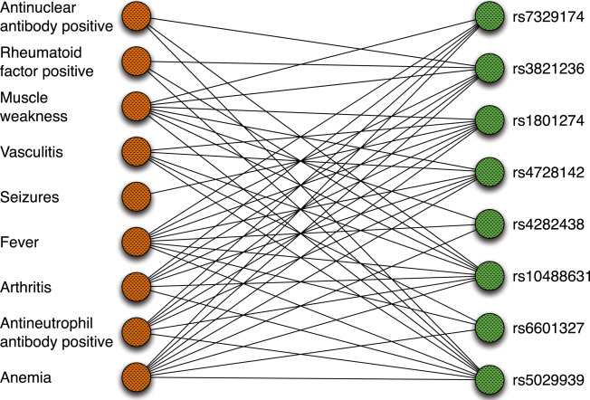
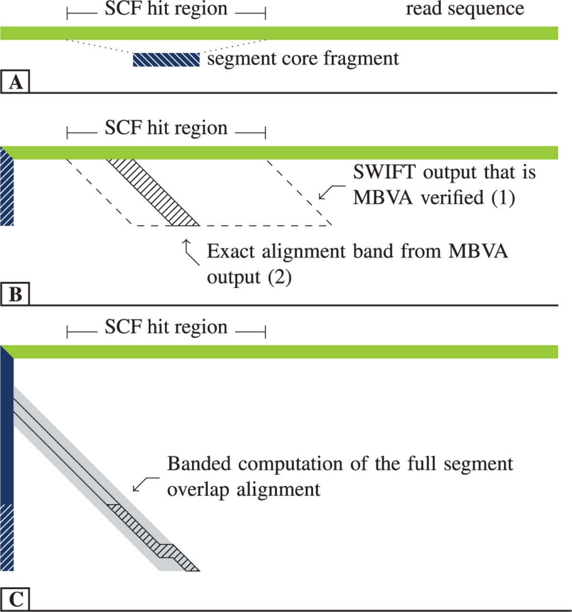
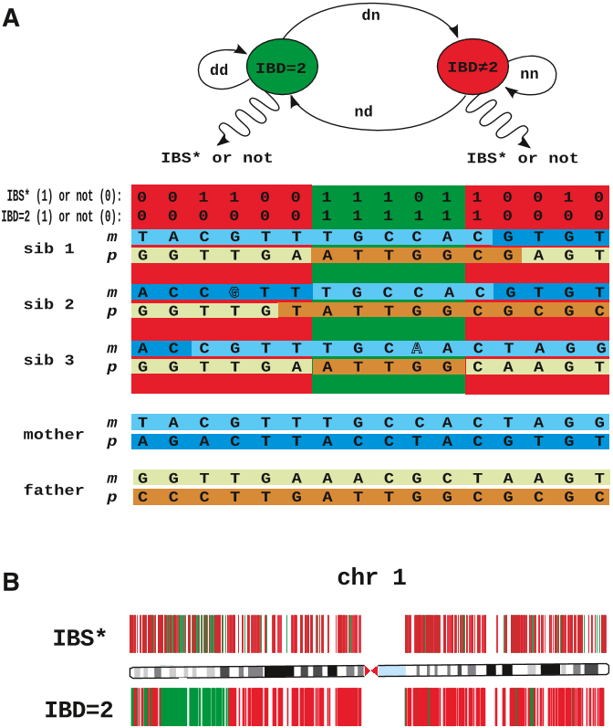

# Research

 The Robinson lab develops a wide range of algorithms, computational resources, and applications.

			 
## Computational Phenotype Analysis

Deep phenotyping has been defined as the precise and comprehensive analysis of phenotypic abnormalities in which the individual components of the phenotype are observed and described.
  Our lab has developed the [Human Phenotype Ontology (HPO)](http://www.human-phenotype-ontology.org).
  The three components of the HPO project are the phenotype vocabulary, disease-phenotype annotations and the algorithms that operate on these. These components are being used for computational deep phenotyping and precision medicine as well as integration of clinical data into translational research. The HPO is being increasingly adopted as a standard for phenotypic abnormalities by diverse groups such as international rare disease organizations, registries, clinical labs, biomedical resources, and clinical software tools and will thereby contribute toward nascent efforts at global data exchange for identifying disease etiologies.

Our group has developed software to use the HPO for computational differential diagnostics including Phenomizer and BOQA, as well as for the phenotype-driven analysis of Array CGH, exome and genome data, including Exomiser, Genomiser, and PhenogramViz.

<figure markdown>
{ width="300" }
<figcaption>Groza T, et al. (2015) The Human Phenotype Ontology: Semantic Unification of Common and Rare Disease. Am J Hum Genet. 97(1):111-24.
</figcaption>
</figure>

## Bioinformatics for Genomics

Our lab has developed software for Chromatin immunoprecipitation coupled with next-generation sequencing (ChIP-seq) and related methods, for NGS-based analysis of T-cell receptor repertoires, and is currently working on 3C-based methods for interrogated gene regulation. 

<figure markdown>
{ width="300" }
<figcaption>Kuchenbecker L, et al. (2015) IMSEQ--a fast and error aware approach to immunogenetic sequence analysis. Bioinformatics. 31(18):2963-71. 
</figcaption>
</figure>

## NGS-based Disease-Associated Gene Discovery

We have used whole-exome and whole-genome sequencing to characterize novel disease-associated genes.
   We identified the cause of Hyperphosphatasia with Mental Retardation Syndrome (HPMRS, also known as Mabry syndrome) by exome sequencing in 2010. This was the first disease-associated gene to be identified in the
   glycosylphosphatidylinositol (GPI) anchor synthesis pathway, and subsequently we and others have identified numerous other disease-associated genes in the  GPI pathway. 

<figure markdown>
{ width="400" }
<figcaption>Krawitz, P. M., et al. (2010). Identity-by-descent filtering of exome sequence data identifies PIGV mutations in hyperphosphatasia mental retardation syndrome. Nat. Genet. 42:827–829.
</figcaption>
</figure>

	

