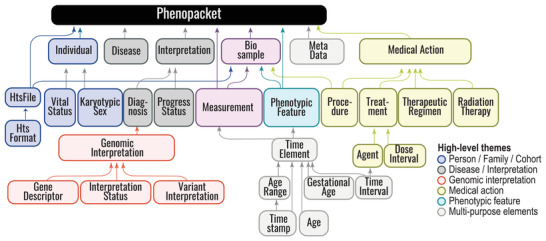

# Software

The Robinson lab develops a wide range of algorithms, computational resources, and applications. We use Java, Python, R, and occasionally
C++, Perl, or Rust. We emphasize good software engineering practices in bioinformatics. This page provides an overview of some of the
software or computational resources of the lab.

## The Human Phenotype Ontology (HPO)

The Human Phenotype Ontology (HPO) aims to provide a standardized vocabulary of phenotypic abnormalities encountered in human disease.
Terms in the HPO describe individual phenotypic abnormalities such as atrial septal defect.
For further details and information please refer to the 
[Human Phenotype Ontology Homepage](http://www.human-phenotype-ontology.org). The HPO is developed 
as a part of the [Monarch Initiative](http://monarchinitiative.org).
S|HPO - GitHub||link:https://github.com/obophenotype/human-phenotype-ontology|

## The Global Alliance for Health (GA4GH) Phenopacket Schema

The Phenopacket Schema represents an open standard for sharing disease and phenotype information to improve our ability to understand, diagnose, and treat both rare and common diseases. A Phenopacket links detailed phenotype descriptions with disease, patient, and genetic information, enabling clinicians, biologists, and disease and drug researchers to build more complete models of disease. The standard is designed to encourage wide adoption and synergy between the people, organizations and systems that comprise the joint effort to address human disease and biological understanding.

<figure markdown>
{ width="300" }
<figcaption>GA4GH Phenopacket Schema
</figcaption>
</figure>

* [Jacobsen JOB, et al. (2022) The GA4GH Phenopacket schema defines a computable representation of clinical data. Nat Biotechnol. 40:817-820](https://pubmed.ncbi.nlm.nih.gov/35705716/)
S|phenopacket-schema - GitHub||link:https://github.com/phenopackets/phenopacket-schema|
* [Danis D,et al. (2023) Phenopacket-tools: Building and validating GA4GH Phenopackets. PLoS One. 18:e0285433](https://pubmed.ncbi.nlm.nih.gov/37196000/);
S|phenopacket-tools - GitHub||link:https://github.com/phenopackets/phenopacket-tools|

## Exomiser

The Exomiser is a Java program that functionally annotates and prioritises variants from whole-exome sequencing data starting from a 
VCF file. The Exomiser was developed by our group, Damian Smedley and Jules Jacobsen of the Mouse Informatics Group at the Sanger Institute (now at the 100,000 Genomes Project and Quenn Mary's University in London), and other members of the [Monarch Initiative](http://monarchinitiative.org).
- [Robinson et al., 2014, Genome Research](https://pubmed.ncbi.nlm.nih.gov/24162188/){:target="_blank"} and [Smedley et al. (2015)](http://www.ncbi.nlm.nih.gov/pubmed/26562621){:target="_blank"}
S|Exomiser - GitHub||link:https://github.com/exomiser/Exomiser|

- An [online demo version](https://exomiser.monarchinitiative.org/exomiser/) is available

	

## Phenomizer
The [Phenomizer](http://compbio.charite.de/phenomizer)  aims to help clinicians to identify the correct differential diagnosis 
in the field of human genetics.
The user enters the signs/symptoms of the patient encoded as terms from the 
[HPO](http://www.human-phenotype-ontology.org). 
The software then ranks all diseases from OMIM, Orphanet, and DECIPHER by a score that reflects how well the phenotypic profiles of the patient and the disease match to each other.

- See also [Kohler, S. et al., 2009](http://www.ncbi.nlm.nih.gov/pubmed/19800049)

			
## ChIP-seq software

Chromatin immunoprecipitation coupled with next-generation sequencing (ChIP-seq) is a powerful technology to identify the genome-wide locations of transcription factors and other DNA binding proteins. Computational ChIP-seq peak calling infers the location of protein-DNA interactions based on various measures of enrichment of sequence reads.
Our algorithm, Q,  uses an assessment of the quadratic enrichment of reads to center candidate peaks followed by statistical analysis of saturation of candidate peaks by 5' ends of reads. We show that our method not only is substantially faster than several competing methods but also demonstrates statistically significant advantages with respect to reproducibility of results and in its ability to identify peaks with reproducible binding site motifs.

- [Hansen P, et al. (2015) Saturation
analysis of ChIP-seq data for reproducible identification of binding peaks. Genome Res 25:1391-400.](http://www.ncbi.nlm.nih.gov/pubmed/26163319)
S|Q - GitHub||link:https://github.com/charite/Q|
* [Hansen P, et al. (2016) Q-nexus: a comprehensive and efficient analysis pipeline designed for ChIP-nexus. BMC Genomics 17:873](https://pubmed.ncbi.nlm.nih.gov/27814676/)
		

## IMSEQ--a fast and error aware approach to immunogenetic sequence analysis

Recombined T- and B-cell receptor repertoires are increasingly being studied using next generation sequencing (NGS) in order to interrogate the repertoire composition as well as changes in the distribution of receptor clones under different physiological and disease states. 
This type of analysis requires efficient and unambiguous clonotype assignment to a large number of NGS read sequences, 
including the identification of the incorporated V and J gene segments and the CDR3 sequence. 
Current tools have deficits with respect to performance, accuracy and documentation of their underlying algorithms and usage.
IMSEQ is a method to derive clonotype repertoires from NGS data with sophisticated routines for handling errors stemming 
from PCR and sequencing artefacts. The application can handle different kinds of input data originating from single- or 
paired-end sequencing in different configurations and is generic regarding the species and gene of interest.
The software can be downloaded from the [project homepage](https://www.imtools.org).

- See also [Kuchenbecker, L. et al., 2015](http://www.ncbi.nlm.nih.gov/pubmed/25987567).

     

