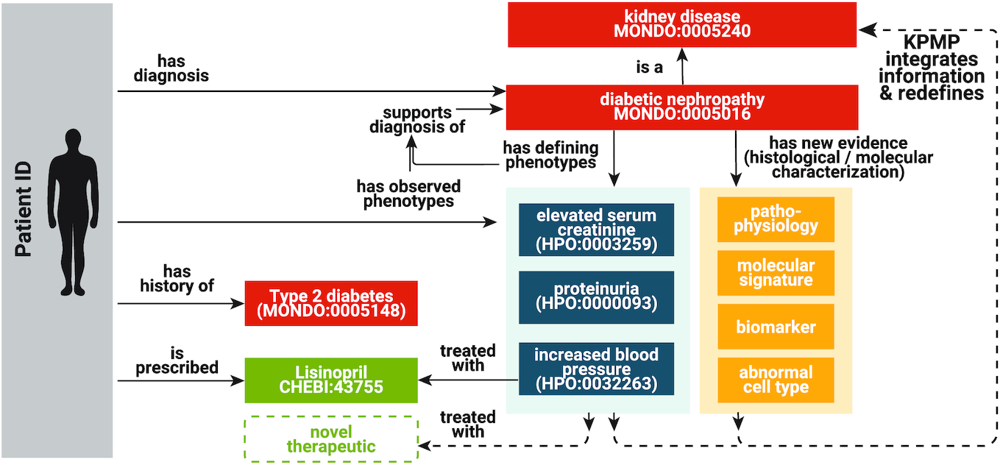
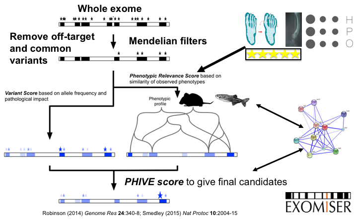
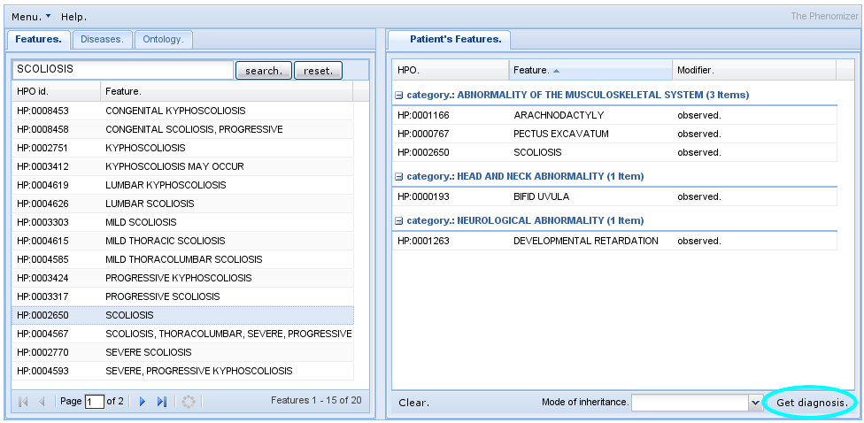
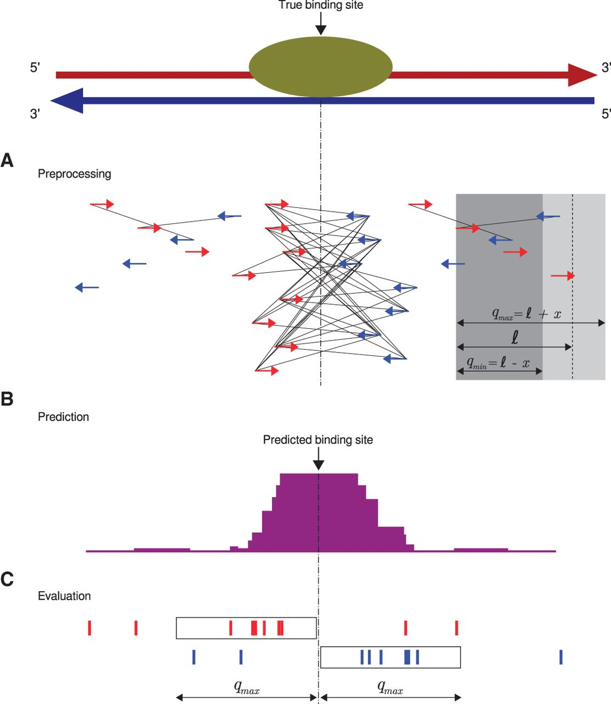

# Software

The Robinson lab develops a wide range of algorithms, computational resources, and applications. We use Java, Python, R, and occasionally
C++, Perl, or Rust. We emphasize good software engineering practices in bioinformatics. This page provides an overview of some of the
software or computational resources of the lab.

## The Human Phenotype Ontology (HPO)

The [Human Phenotype Ontology (HPO)](http://www.human-phenotype-ontology.org) aims to provide a standardized vocabulary of phenotypic abnormalities encountered in human disease.
Terms in the HPO describe individual phenotypic abnormalities such as atrial septal defect.
The HPO is developed as a part of the [Monarch Initiative](http://monarchinitiative.org).

[HPO :material-github:](https://github.com/obophenotype/human-phenotype-ontology){: .md-button .md-button--primary }

<figure markdown>
{ width="400" }
<figcaption>Using HPO to suppor the Kidney Precision Medicine Project (KPMP). Figure from 
Köhler et al (2021) The Human Phenotype Ontology in 2021. Nucleic Acids Res; 49:D1207-D1217
</figcaption>
</figure>

## The Medical Action Ontology (MAxO)
the Medical Action Ontology (MAxO), the first ontology specifically designed to organize medical procedures, therapies, and interventions in a structured way. 
Currently, MAxO contains 1757 medical action terms added through a combination of manual and semi-automated processes.

[MAxO :material-github:](https://github.com/monarch-initiative/maxo){: .md-button .md-button--primary }

## The Global Alliance for Health (GA4GH) Phenopacket Schema

The Phenopacket Schema represents an open standard for sharing disease and phenotype information to improve our ability to understand, diagnose, and treat both rare and common diseases. A Phenopacket links detailed phenotype descriptions with disease, patient, and genetic information, enabling clinicians, biologists, and disease and drug researchers to build more complete models of disease. The standard is designed to encourage wide adoption and synergy between the people, organizations and systems that comprise the joint effort to address human disease and biological understanding.

<figure markdown>
{ width="300" }
<figcaption>GA4GH Phenopacket Schema
</figcaption>
</figure>

* [Jacobsen JOB, et al. (2022) The GA4GH Phenopacket schema defines a computable representation of clinical data. Nat Biotechnol. 40:817-820](https://pubmed.ncbi.nlm.nih.gov/35705716/)

[Phenopacket-Schema :material-github:](https://github.com/phenopackets/phenopacket-schema){: .md-button .md-button--primary }

* [Danis D,et al. (2023) Phenopacket-tools: Building and validating GA4GH Phenopackets. PLoS One. 18:e0285433](https://pubmed.ncbi.nlm.nih.gov/37196000/);

[Phenopacket TOOLS :material-github:](https://github.com/phenopackets/phenopacket-tools){: .md-button .md-button--primary }

## Exomiser

The Exomiser is a Java program that functionally annotates and prioritises variants from whole-exome sequencing data starting from a 
VCF file. The Exomiser was developed by our group, Damian Smedley and Jules Jacobsen of the Mouse Informatics Group at the Sanger Institute (now at the 100,000 Genomes Project and Quenn Mary's University in London), and other members of the [Monarch Initiative](http://monarchinitiative.org).

- [Robinson et al., 2014, Genome Research](https://pubmed.ncbi.nlm.nih.gov/24162188/){:target="_blank"} and [Smedley et al. (2015)](http://www.ncbi.nlm.nih.gov/pubmed/26562621){:target="_blank"}

[Exomiser :material-github:](https://github.com/exomiser/Exomiser){: .md-button .md-button--primary }

<figure markdown>
{ width="400" }
<figcaption>Overview of Exomiser algorithm
</figcaption>
</figure>

## Phenomizer
The [Phenomizer](http://compbio.charite.de/phenomizer)  aims to help clinicians to identify the correct differential diagnosis 
in the field of human genetics.
The user enters the signs/symptoms of the patient encoded as terms from the 
[HPO](http://www.human-phenotype-ontology.org). 
The software then ranks all diseases from OMIM, Orphanet, and DECIPHER by a score that reflects how well the phenotypic profiles of the patient and the disease match to each other.

- See also [Kohler, S. et al., 2009](http://www.ncbi.nlm.nih.gov/pubmed/19800049)

<figure markdown>
{ width="400" }
<figcaption>Phenomizer Graphical User Interface
</figcaption>
</figure>

## Phenol
Phenol is a Java library for working with JSON phenotype ontologies including especially the Human Phenotype Ontology and 
the Mammalian Phenotype Ontology and associate phenotype annotation files.

[Phenol :material-github:](https://github.com/monarch-initiative/phenol){: .md-button .md-button--primary }

	

## LIRICAL
LIkelihood Ratio Interpretation of Clinical AbnormaLities (LIRICAL)   exploits the likelihood ratio (LR) 
framework to provide an estimate of (1) the posttest probability of candidate diagnoses, 
(2) the LR for each observed HPO phenotype, and (3) the predicted pathogenicity of observed genotypes.

[LIRICAL :material-github:](https://github.com/TheJacksonLaboratory/LIRICAL){: .md-button .md-button--primary }

	

<figure markdown>
{ width="400" }
<figcaption>Robinson PN, et al. (2020) Interpretable Clinical Genomics with a Likelihood Ratio Paradigm. Am J Hum Genet; 107:403-417.
</figcaption>
</figure>

## SQUIRLS
The Super Quick Information-content Random-forest Learning of Splice variants (SQUIRLS) algorithm 
generates a small set of interpretable features for machine learning by calculating the information-content 
of wild-type and variant sequences of canonical and cryptic splice sites, assessing changes in candidate 
splicing regulatory sequences, and incorporating characteristics of the sequence such as exon length, 
disruptions of the AG exclusion zone, and conservation. 

[SQUIRLS :material-github:](https://github.com/TheJacksonLaboratory/SQUIRLS){: .md-button .md-button--primary }

	

<figure markdown>
{ width="400" }
<figcaption>Danis D, et al (2021) Interpretable prioritization of splice variants in diagnostic next-generation sequencing. 
Am J Hum Genet; 108:1564-1577.
</figcaption>
</figure>

## SvAnna
Structural variants (SVs) are implicated in the etiology of Mendelian diseases but have been systematically 
underascertained owing to sequencing technology limitations. Long-read sequencing enables comprehensive 
detection of SVs, but approaches for prioritization of candidate SVs are needed. Structural variant 
Annotation and analysis (SvAnna) assesses all classes of SVs and their intersection with transcripts and regulatory 
sequences, relating predicted effects on gene function with clinical phenotype data. 

[SvAnna :material-github:](https://github.com/TheJacksonLaboratory/SvAnna){: .md-button .md-button--primary }

	

<figure markdown>
{ width="400" }
<figcaption>Danis D. et al. (2022) SvAnna: efficient and accurate pathogenicity prediction of coding and regulatory structural variants in long-read genome sequencing. 
Genome Med; 14:44. 
</figcaption>
</figure>	

## ChIP-seq software

Chromatin immunoprecipitation coupled with next-generation sequencing (ChIP-seq) is a powerful technology to identify the genome-wide locations of transcription factors and other DNA binding proteins. Computational ChIP-seq peak calling infers the location of protein-DNA interactions based on various measures of enrichment of sequence reads.
Our algorithm, Q,  uses an assessment of the quadratic enrichment of reads to center candidate peaks followed by statistical analysis of saturation of candidate peaks by 5' ends of reads. We show that our method not only is substantially faster than several competing methods but also demonstrates statistically significant advantages with respect to reproducibility of results and in its ability to identify peaks with reproducible binding site motifs.

[Q :material-github:](https://github.com/charite/Q){: .md-button .md-button--primary }

	

<figure markdown>
{ width="400" }
<figcaption>Hansen P, et al. (2015) Saturation
analysis of ChIP-seq data for reproducible identification of binding peaks. Genome Res 25:1391-400.
</figcaption>
</figure>

		
## GOPHER
 Target enrichment combined with chromosome conformation capturing methodologies such as capture Hi-C (CHC) can be used 
 to investigate spatial layouts of genomic regions with high resolution and at scalable costs. A common application of CHC is the investigation of regulatory elements that are in contact with promoters, but CHC can be used for a range of other applications. 
GOPHER (Generator Of Probes for capture Hi-C Experiments at high Resolution) is an easy-to-use and robust desktop application for CHC probe design

[GOPHER :material-github:](https://github.com/TheJacksonLaboratory/Gopher){: .md-button .md-button--primary }

	

<figure markdown>
{ width="400" }
<figcaption>Hansen P et al. (2019) GOPHER: Generator Of Probes for capture Hi-C Experiments at high Resolution. BMC Genomics; 20(1):40.</figcaption>
</figure>

## HBA-DEALS
Hierarchical Bayesian Analysis of Differential Expression and ALternative Splicing (HBA-DEALS) is an R package that 
simultaneously characterizes differential gene expression and alternative splicing in high-throughput gene expression data. 
It uses counts data for isoforms (alternative transcripts of a gene) to infer the parameters of a hierarchical 
Bayesian model of expression and splicing. It then uses the posterior of the parameters to determine the existence 
of differential expression and/or differential alternative splicing. Isoform counts can be derived from short-read 
sequencing RNA-Seq data or from long-read RNA sequencing data such as that generated by the PacBio SequelII platform.

[HBA-DEALS :material-github:](https://github.com/TheJacksonLaboratory/HBA-DEALS){: .md-button .md-button--primary }

<figure markdown>
{ width="400" }
<figcaption>Karlebach G, et al. (2020) HBA-DEALS: accurate and simultaneous identification of differential expression and splicing using hierarchical Bayesian analysis. Genome Biol;21:171. 
</figcaption>
</figure>
     
## isopret
isopret (*isoform interpretation*) is a method that uses expectation–maximization to infer isoform-specific 
functions based on the relationship between sequence and functional isoform similarity. 
We predicted isoform-specific functional annotations for 85 617 isoforms of 17 900 protein-coding human genes spanning 
a range of 17 430 distinct gene ontology terms. 

[isopretEM :material-github:](https://github.com/TheJacksonLaboratory/isopretEM){: .md-button .md-button--primary }

<figure markdown>
{ width="400" }
<figcaption>Karlebach G (2023) An expectation-maximization framework for comprehensive prediction of isoform-specific functions. Bioinformatics; 39(4):btad132.</figcaption>
</figure>

